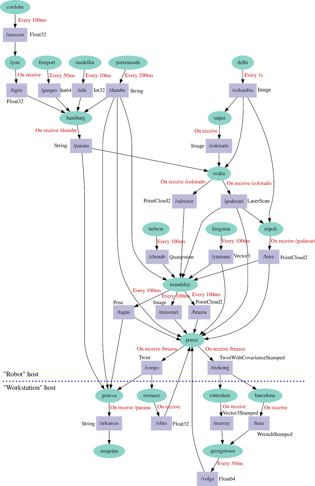

# FastDDS montblanc Test Scenario

## Description

> This test application used in the experiments for evaluating the primary metric is based on the [iRobot Mont Blanc performance benchmark topology](https://github.com/irobot-ros/ros2-performance/blob/master/irobot_benchmark/topology/mont_blanc.pdf).
> 
> **The topology is modified** to use standard ROS types and have on-receive based topic publications as well as timing based.
> 
> This application is implemented as one process per “node”. The nodes in the application print reception of data to standard output, and publish their outputs on the triggers indicated in the figure.

You'll find the image explaining the modified test topology below.

## Directory Overview

- `msg/`: Message IDL definitions and generated headers and code

- `src/`: App source

- `include/`: App headers

- `bin/`: Compiled executables

- `assets/`: Image assets for README

## Setup

This setup guide will help you install the pre-requisites and dependencies necessary for running this test application, including:

- eProsima FastDDS

- Java Runtime

### Steps

1. Install the dependencies for the dependencies

```shell
sudo apt install libasio-dev libtinyxml2-dev default-jre
```

2. Download the FastDDS installer

Download the installer from [here](https://www.eprosima.com/index.php/products-all/eprosima-fast-dds) and run the setup

```shell
cd eProsima_Fast-DDS-<VERSION>-<OS>
sudo ./install.sh 
```

Also remember to make sure that your installed libraries are findable! You can append this line to `~/.bashrc`:

```shell
export LD_LIBRARY_PATH=/usr/local/lib/
```

## Message Generation

Because the mont_blanc test scenario contains a whole bunch of ROS2 message structs (including nested structs), the FastDDS generator tool [fastddsgen](https://fast-dds.docs.eprosima.com/en/latest/fastddsgen/usage/usage.html) was used to do the conversion from IDL.

Most of the IDL definitions used here were repurposed from [this repo](https://github.com/rticommunity/ros-data-types).

- `idl/`: Where the IDL file definitions are

- `gen/`: Folder for generated headers and code

### Generating Your Own Messages

> **BIG WARNING**: The `fastddsgen` tool works for basic IDL definitions, but is quite buggy once you start needing to do more complicated things like:
> 
> - Having IDL includes
> 
> - Having custom IDL types used in containers (e.g. sequences of a custom type)
> 
> These issues have been sidestepped for this test with certain procedures that will be documented below.

If you want to generate your own message objects, run the following commands on your own IDL files (ensuring that they follow [the spec](https://fast-dds.docs.eprosima.com/en/latest/fastddsgen/dataTypes/dataTypes.html)).

This will generate all yet-to-be-generated type files and place them in the same directory structure that they appeared in the `idl/` directory!

```shell
cd <REPO_ROOT>/msg/idl

find . -name "*.idl" -exec sh -c '
  for file do
    printf "\n\n[GENERATING: ${file}]\n"
    mkdir -p ../gen/$(dirname ${file})
    fastddsgen ${file} -typeros2 -d ../gen/$(dirname ${file}) -I . -cs
  done' sh {} +
```

>  If you want to split your headers and sources, remember to move the generated headers to the appropriate location in `include/` and **update the generated sources' include statements**.
> 
> For the generated sources, this means appending `"type/"` to the include path.
> 
> In other words:
> 
> ```cpp
> #include "types/datatypesPubSubTypes.h"
>           ^^^^^
> 
> #include "types/datatypes.h"
>           ^^^^^
> ```
> 
> 

### The Caveats

**IDL includes**

The IDL spec allows for other IDL definitions to be included in another definition. `fastddsgen` invokes a pre-processor to replace the include line with the contents of the included file. This works as intended, but for some reason very often, `fastddsgen` deterministically fails to generate a valid source file.

This is a [yet unsolved issue](https://github.com/eProsima/Fast-DDS-Gen/issues/97), so the way around this is to list all IDL definitions in a **single file**, doing the job of the pre-processor.

**Custom IDL Types in Sequence**

The fastddsgen IDL spec doesn't explicitly support this case, but the fix that allows this to work is fairly simple-- the generated sources need to be manually patched.

This is because there is a missing `const operator ==` operator overload.

So just manually patch it in the generated header and source file!

For example:

```cpp
// TypeName.h

    eProsima_user_DllExport bool operator ==(
            const PointField& x);

    // Patched in
    eProsima_user_DllExport const bool operator ==(
            const PointField& x) const;
```

```cpp
// TypeName.cxx

bool PointField::operator ==(
        const PointField& x)
{

    return (m_name == x.m_name && m_offset == x.m_offset && m_datatype == x.m_datatype && m_count == x.m_count);
}

// Patched in
const bool PointField::operator ==(
        const PointField& x) const
{

    return (m_name == x.m_name && m_offset == x.m_offset && m_datatype == x.m_datatype && m_count == x.m_count);
}
```

### Generating Examples

> If you want an example pubsub application to go with the generated files, simply append `-example CMake` to the `fastddsgen` invocation!
> 
> The example files will be suffixed (before the extension) with:
> 
> - Publisher
> 
> - Subscriber
> 
> - PubSubMain

> Alternatively, if you just want to do your generation one at a time, just invoke `fastddsgen` appropriately:
> 
> ```shell
> fastddsgen <FILE>.idl -typeros2 -cs -d <OUTPUT_DIR> -I <IDL_INCLUDE_DIR>
> ```
> 
> The `-cs` argument is especially important to prevent keyword conflicts.

## Test Topology


